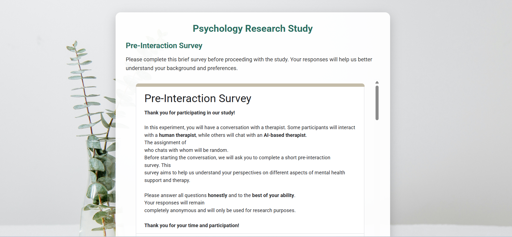

# Psychology Research Study Web Application

## Table of Contents
1. [Overview](#overview)
2. [Features](#features)
3. [Study Flow](#study-flow)
4. [Technical Details](#technical-details)
5. [Installation](#installation)
6. [Contact Information](#contact-information)

## Overview
This web application was designed to conduct a psychology research study as part of Lynn Weisker's master thesis. The application facilitates interactions between participants and different types of therapeutic advice (empathetic vs. rational), collecting data through pre and post-interaction surveys.

👉 [**Click here to check the experiment**](https://arad1367.github.io/therapist/)

## Features
- Pre-interaction survey for participant background information
- Randomized assignment to either empathetic or rational advice
- Topic selection (anxiety, depression, or stress)
- Timed chat session with a virtual therapist
- Post-interaction feedback survey
- Clean, responsive user interface

## Study Flow
1. Participants complete the pre-interaction survey
2. Participants choose between "Empathetic Advice" or "Rational Advice" (system randomly assigns actual type)
3. Participants select a topic (anxiety, depression, or stress)
4. Participants engage in a 10-minute chat session with the virtual therapist
5. After the session, participants complete a post-interaction survey

## Technical Details
- Built with HTML, CSS, and JavaScript
- Uses Google Forms for surveys
- Integrates Flowise AI for the chat interface
- Responsive design that works across different devices
- Timer functionality for controlled session duration

## Installation
1. Clone this repository to your local machine or web server
2. No additional dependencies need to be installed
3. Open the `index.html` file in a web browser to start the application
4. Ensure an active internet connection for the forms and chat functionality

## Contact Information
For questions or issues related to this research study, please contact:

**Research Lead:**  
Lynn Miriam Weisker  
Email: lynn.weisker@uni.li

**Technical Support:**  
Pejman Ebrahimi  
Email: pejman.ebrahimi@uni.li
